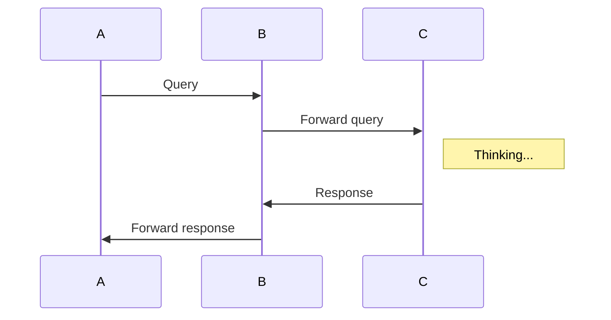

# Hello-world
my exercise

This is my first edit on this branch.

```mermaid
sequenceDiagram
  A->> B: Query
  B->> C: Forward query
  Note right of C: Thinking...
  C->> B: Response
  B->> A: Forward response
```
